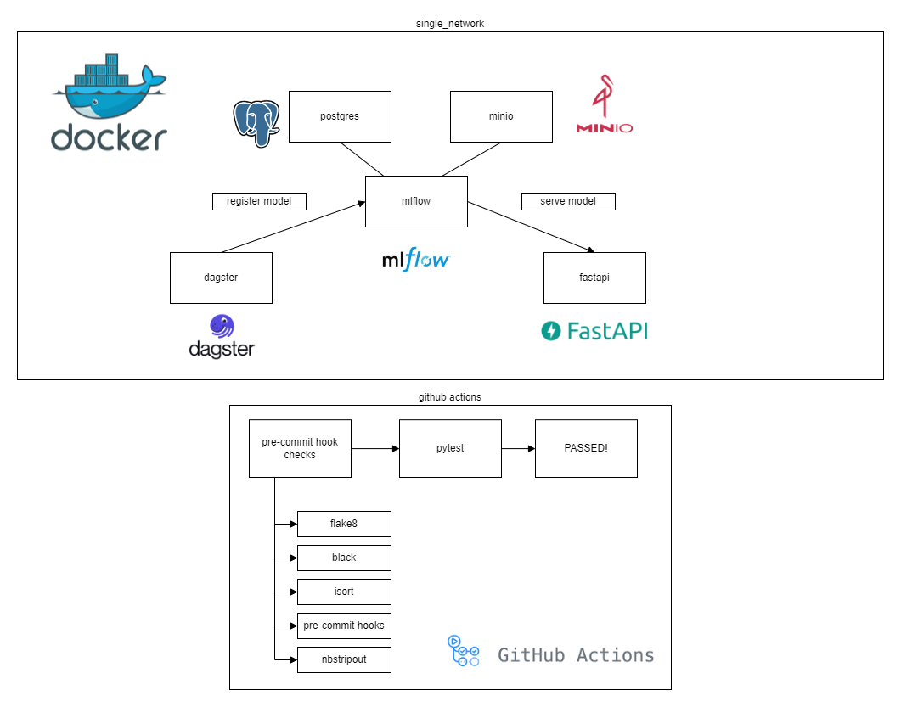
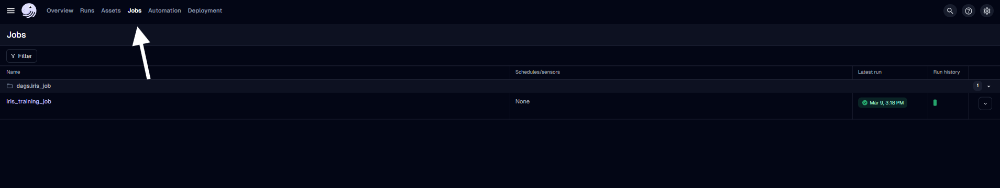
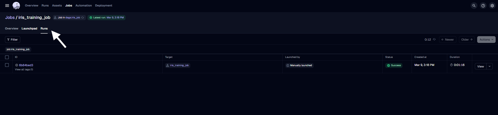

# mlops_final_project

## Project Architecture


## Directory Structure
- `.github/workflows` - contains `pre-commit.yml` defines what is run in github actions
- `images` - images reference to markdown files
- `src` - source directory
  - `api` - fast api souce code to predict from deployed model
  - `dagster` - train model and register model to mlflow
  - `notebooks` - notebook to test 
  - `dockerfiles` - all container dockerfiles consolidated here
- `tests` - test directory

## Github Actions
- pre-commit
  - See `.github/workflows/pre-commit.yml` and `.pre-commit-config.yaml`
- pytest

## Deploying Docker Locally
- Deploying:
```commandline
docker-compose --env-file sample_env up --build -d
```
- Cleanup:
```commandline
docker-compose down
```

## Executing dagster job
- Select job

- Run job


## Important links 
- (after containers are up and dagster job has run to test endpoint)
  - dagster [http://localhost:3000](http://localhost:3000)
  - mlflow [http://localhost:5000](http://localhost:5000)
  - minio object storage [http://localhost:9001](http://localhost:9001)
  - jupyterlab [http://localhost:8888](http://localhost:8888)
  - fastapi
    - [http://localhost:8000/docs](http://localhost:8000/docs)
    - to get predictions via cURL (or use notebook in jupyterlab)
    ```commandline
    curl --location 'http://localhost:8000/predict' \
    --header 'Content-Type: application/json' \
    --data '{
        "data": [
            [5.1, 3.5, 1.4, 0.2],
            [6.7, 3.1, 4.4, 1.4],
            [6.7, 3.1, 4.4, 1.4]
        ]
    }'
    ```
    